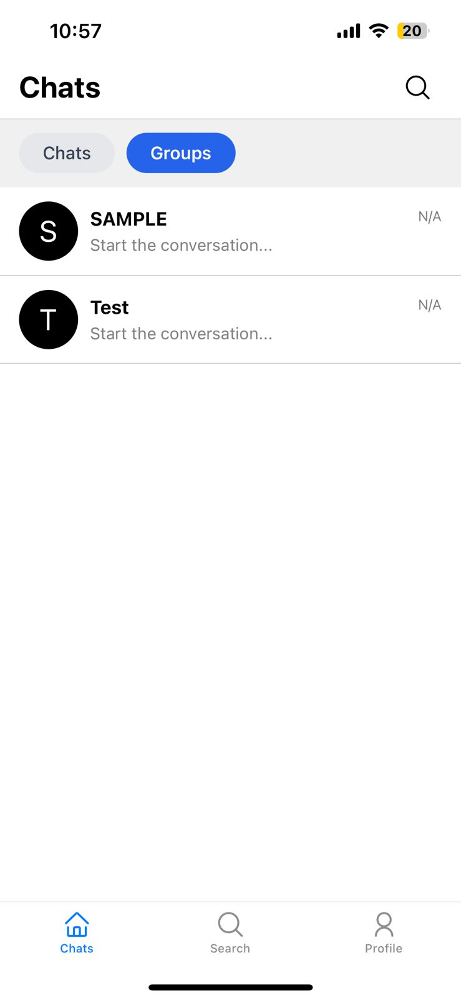
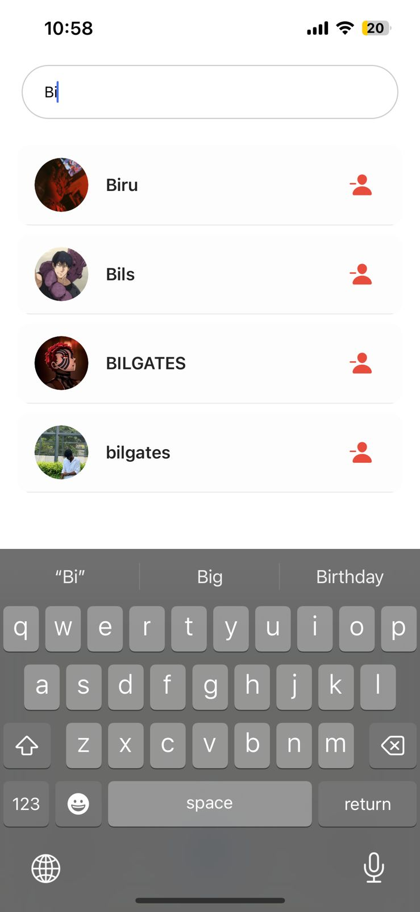
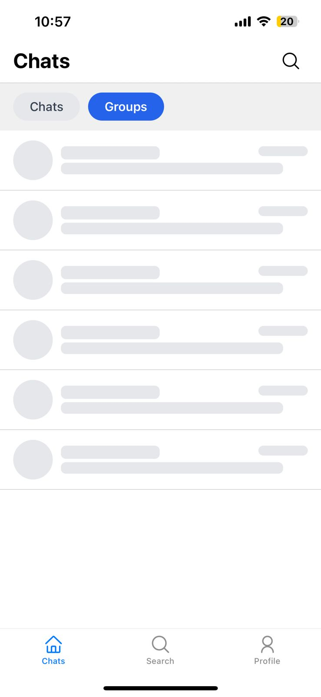
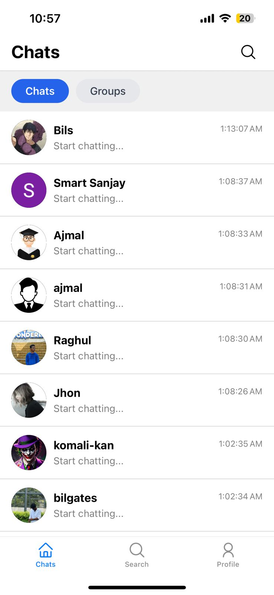
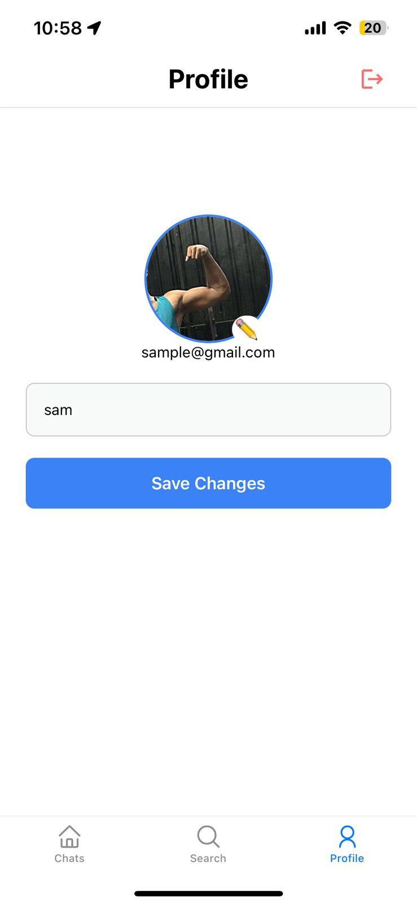

# NovaChat 🚀

NovaChat is a real-time chat application built with React Native and Firebase. It allows users to engage in private and group conversations with seamless synchronization, authentication, and a clean mobile UI.

## 📸 Screenshots

  
  
  
  
  

## 📱 Features

- 🔐 **User Authentication**
  - Sign up / Log in with email & password
  - Secure Firebase Authentication

- 🧑‍🤝‍🧑 **User Discovery**
  - Search for other users by name or email
  - View list of all registered users (if public)

- 💬 **Private One-to-One Chat**
  - Real-time messaging
  - Firebase Firestore with onSnapshot listeners

- 👥 **Group Chats**
  - Create and join group chats
  - Real-time sync across all group members

- 🔄 **Real-Time Updates**
  - Messages sync instantly using Firebase Firestore
  - Typing indicators and message status (optional)

## 🛠️ Tech Stack

- **Frontend**: React Native (TypeScript + Expo)
- **Backend**: Firebase
  - Authentication
  - Firestore (Database)
  - Cloud Storage (optional for media)
